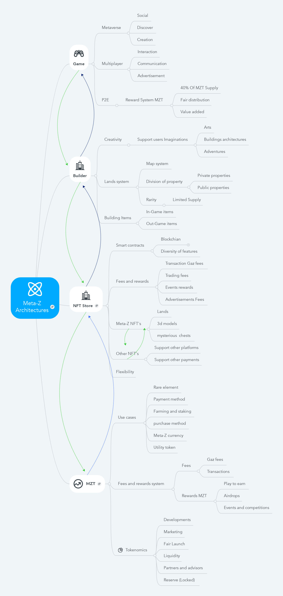

# Economy

### 4.1 Smart Contracts

Smart contracts are implemented in the Solidity language. at the moment, the project has the MZT Coin cryptocurrency protocol based on the BEP-20. MZT is a BEP20 token powered by Binance Smart Chain and designed as a currency for the world Z. Z. It is the measurement currency that will be used for the fair exchange of items created in World Z by users.

(Smart contracts are programs that govern the behaviour of accounts within the blockchain state.)

### 4.2 Tokenomics

