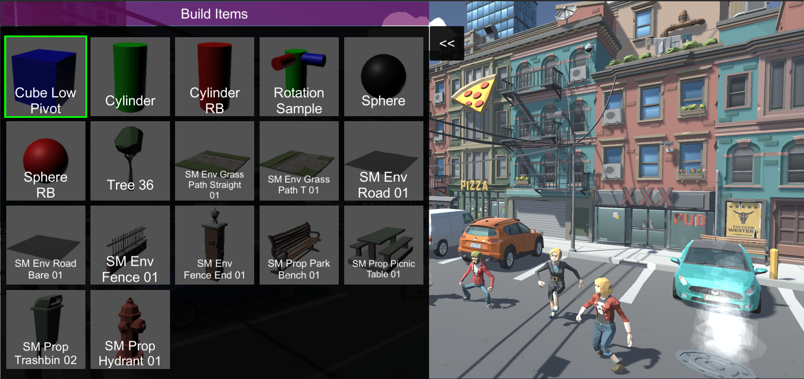
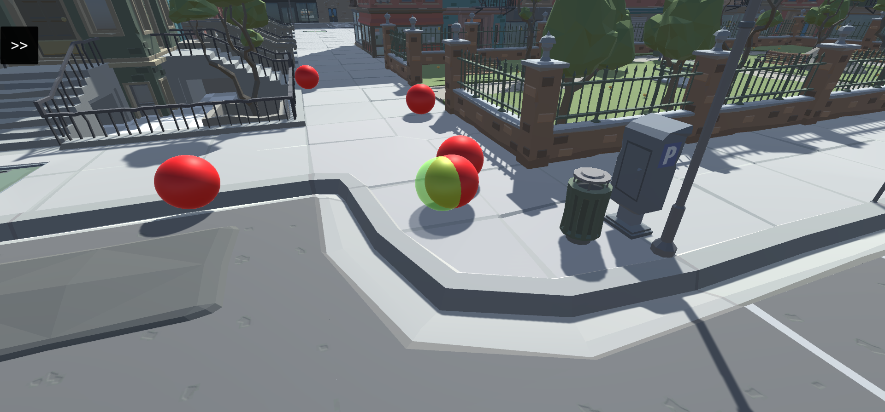

# 🏛 Builder

## 1. Builder main design

You could think of the builder as a seperate game in itself, it has its own camera movment, world settings and plays differently.

The main purpose behind chosing this design is to make it easy for players to create their own worlds separately from the main game world in a clean and organized manners.

## 2. Adding own items/NFTs

the builder design allow for flexible adding of new items, each item must contain (3D model, material, item name), aftyer adding it into the item list it will automatically generate a ghost material (used as a guide to help the player place objects on the game world)

which can be placed later after adding it to the items list into the game world

