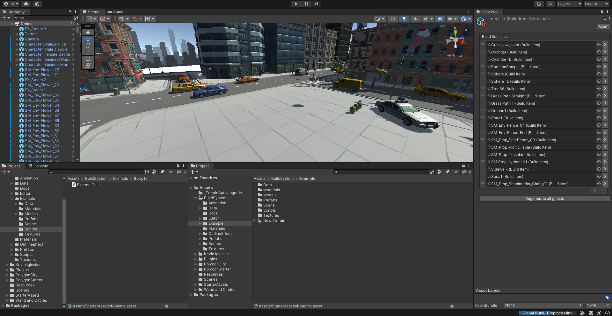
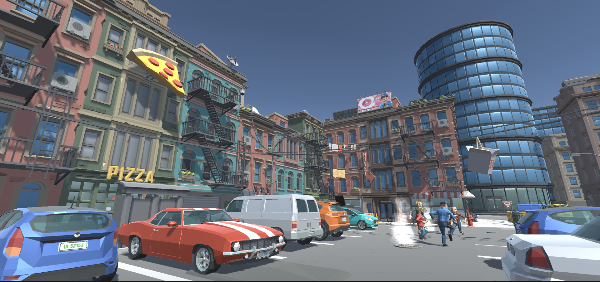

# 🎮 Game

## 1. Game development tools

### 1.1 Unity Engine

Unity version 2020.3 LTS is used for game development as the game engine. It features a great developer community, a modern technological store, a quick game creation approach with low-level enough programming proficiency for our advanced needs, and multi-platform support.

From the network interaction point of view, The Unity Engine restrains numerous built-in data transporting tools with all the required techniques for us, including frequently used Rest API. All the user transported data is safely encrypted and information is secured.

Adjusting our game for desktop platforms, we had a wider range of technological solutions. This comprises several graphics rendering and blockchain computation advantages which improves player experience.

### 1.2 Multiplayer System

Multiplayer System controls all in-game user to user interactions happening in realtime. Due to the difficulty of world building and world scaling, and some other features, our development team adjusted the engine used for the core system managment to satisfy the essential tasks.

For multiplayer we use **Netcode**, Netcode for GameObjects is a Unity package that provides networking capabilities to GameObject & MonoBehaviour workflows. The framework is interoperable with many low-level transports, including the official [Unity Transport Package](https://docs-multiplayer.unity3d.com/transport/1.0.0/introduction).

## 2.Design

### 2.1 Graphical design

For our graphical design choice we decided to go with a low poly style for the sake of both performance and simplicity to mmake the game way more user friendly for newcomers.

we use a variety of low poly 3D models, but mostly polygon and most notably we use **POLYGON PACKS** from unity store.

### 2.2 Gameplay design

the core gameplay revolves around multiplayer interactions, the game focuses heavily around the social part between player rather than Physics, which was a decision we come up with after reviewing multiple metaverse games.

In order for players to build their own stuff they will need to have a valid land "could be obtained from the market" which only they can change however they like, other players may only view it as it is and interact with it.



### 2.3 Play to earn system

We expect a lot of world wide players to invest their time playing the game As so we plan on giving the players a kind of reward for their time spent in meta-z world.

Our earning system is based on giving a daily share prize of Meta-Z token, to be collected by players in the Meta-z world following their efforts and spent time on the game.
