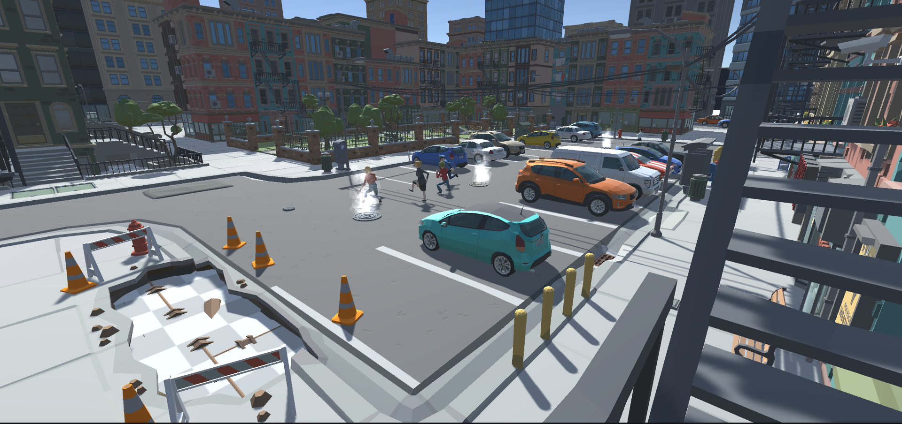

# 👨💼 Project

## Whats is Meta-Z project ?&#x20;

The foundation stone for M**eta-Z** has been laid in **December 2021,** by its founder _Younes Kasdi_, with the help of _Joseph Grey_ and _Nadhir Ferdji_. **Meta-Z** project is a **metaverse game** which is built using the **Unity** engine based on the following concepts:

* Metaverse world
* Social multiplayer
* Play-to-earn game.

**Meta-Z** started as a game prototype for the metaverse, which had a basic concept of allowing players to make their own unique stuff using [**NFT**](https://en.wikipedia.org/wiki/Non-fungible\_token) **** technology and share it with each others, which then branched out into 4 primary building blocks:

* Base Game
* Builder
* Marketplace
* Meta-Z token

